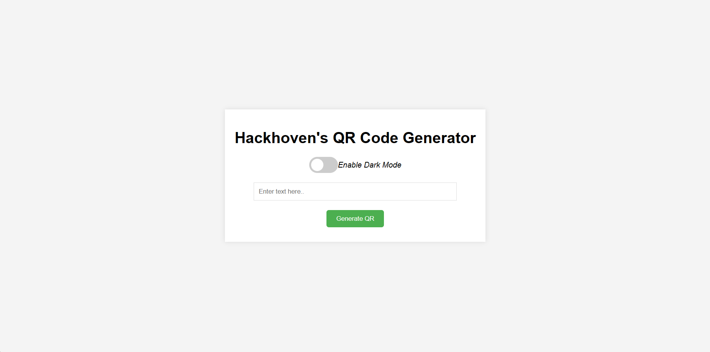
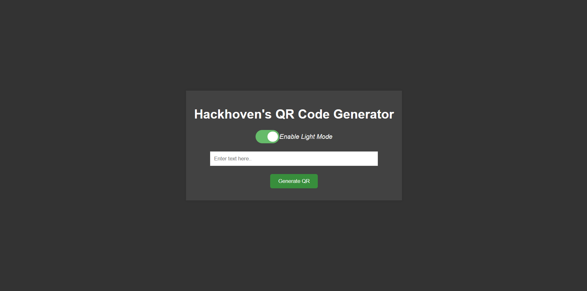
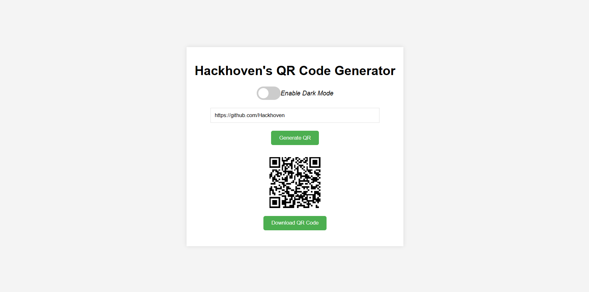

# Hackhoven's QR Code Generator

A simple web application that allows users to create QR codes based on text input. This tool is built using HTML, CSS, and JavaScript, with additional support from the qrcode.js library to generate QR codes dynamically.

## Features

- **Generate QR Codes**: Instantly create QR codes from any text.
- **Download QR Codes**: Save generated QR codes as PNG images.
- **Responsive Design**: Works on both desktop and mobile browsers.
- **Dark Mode Toggle**: Users can switch between light and dark themes for ease of use under different lighting conditions.

## Screenshots

Here are some screenshots of the QR Code Generator in action:

### Main Interface


### Dark Mode


### QR Code Generated



## How to Use

1. **Enter Text**: Type the text you want to convert into a QR code in the input box.
2. **Generate**: Click the 'Generate QR' button to create the QR code.
3. **Download**: Once the QR code appears, use the 'Download QR Code' button to save the QR code as a PNG image.

## Installation

To set up the QR Code Generator locally, follow these steps:

1. Clone the repository:
   ```bash
   git clone https://github.com/yourusername/qr-code-generator.git
   ```
2. Navigate to the project directory
  `cd qr-code-generator`
3. Open the `index.html` file in your web browser

## Contributing

Contributions are welcome! If you'd like to contribute to this project, please fork the repository and submit a pull request with your changes.

# made by Hackhoven !

